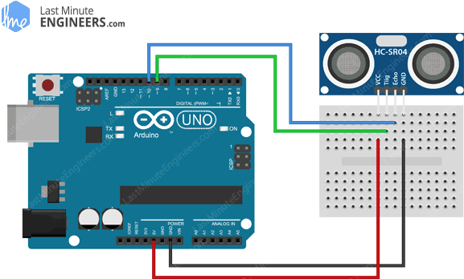

# Experiment 1: Transmitting with Ultrasonic Sensors

## Introduction

In this preliminary experiment, we'll attempt wirelessly powering an LED with the voltage produced across a receiver's terminals from the ultrasonic waves
transmitted by an ultrasonic sensor connected to an Arduino.

## Methods

Our setup consists of an Arduino, [HC-SR04 Ultrasonic Distance Sensor](https://www.sparkfun.com/products/15569), 
and [TCT40-16R Ultrasonic transducer](https://www.lxxtech.com/tct40-16rt-rt-split-ultrasound-ultrasonic-sensor-ultrasonic-probe-center-frequency-40khz-dia-p433.html).
The advantage of using the off-the-shelf sensor to drive the transmitter is that we can interface with it easily. Writing a digital high to the TRIG pin of 
the sensor tells the transmitter to emit 8 consecutive 40kHz (ultrasonic) pulses. These pulses are caught by the receiver placed in the transmitter's line of sight, 
which are then transformed to electrical pulses across its terminals.

The ultrasonic sensor's VCC, TRIG, ECHO, and GND pins are wired to the Arduino's DC 5V, two digital pins, and ground respectively. The following schematic is from an article on [Last Minute Engineers](https://lastminuteengineers.com/arduino-sr04-ultrasonic-sensor-tutorial/).

In Arduino code, we write a program to send 40 kHz pulses consecutively via the transmitter by writing a high to the TRIG pin. The receiver is placed in the transmitter's line of sight, and we measure attempt to measure the signal on its terminals.

## Results

We found that the amplitude of the waves from the transmitter was far too small in magnitude to get a detectable AC voltage at the receiver. However, the digital multimeter picked up a frequency of approximately 3kHz at the terminals. Since the signals were so small, the frequency was unstable and difficult to measure. These results held for very small distances between the transmitter and receiver (< 5 mm).

## Discussion

Although the off-the-shelf ultrasonic sensor can be adapted to be just a transmitter, it doesn't serve its purpose in this experiment since its amplitude is not large enough to give us a useful signal at the receiver's end. This makes sense because the purpose of the ultrasonic sensor's transmitter is to send a pulse large enough to be detected by its receiver after it bounces back from a surface. However, our objective is to transfer power, so the signal produced by the transmitter on the sensor isn't practical for our purposes.

In this experiment, we found the plug-and-play capabilities of the ultrasonic sensor to be a double-edged sword. It's simple to wire up to the Arduino and sending a set of 8 consecutive 40kHz pulses through the transmitter only requires a trigger pulse at one of its pins. However, the hardware abstraction layer of the sensor prevents us from, for example, driving the ultrasonic pulses with a larger amplitude.
