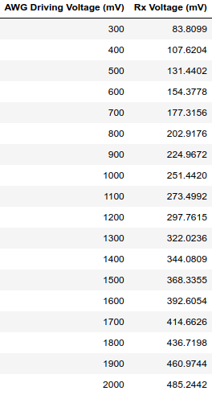

# Experiment 2: Arbitrary Waveform Generator Driven Transmitter

## Introduction

From Experiment 1, we concluded that the ultrasonic waves emitted by the ultrasonic sensor lost too much energy while being transmitted in the air to produce a large enough voltage across the receiver terminals to power an LED. For more granular control and the ability to increase the amplitude of the 40kHz electric pulses into the transmitter, we're going to use a Picoscope's arbitrary waveform generator (AWG). The Picoscope will also allow us to measure the signal on the receiver terminals accurately.

## Methods

Below is the schematic of the circuit we implement for this experiment.

And below are photos of the implemented circuit. The transmitter and receiver circuits are on the right and left side respectively.

Top View                   |  Side View
:-------------------------:|:-------------------------:
  |  

The transmitter circuit is driven by the voltage from the AWG and the scope's probe is measuring the voltage across the terminals of the receiver. We'll drive the AWG with a range of voltages from 0V to 2V and measure the AC voltage induced at the receiver terminals

## Results

For each amplitude driven by the AWG, we recorded the measurement of maxmium and minimum amplitude of the Rx voltage from a window of the Picoscope software once the waveform stabilized. Below is a screenshot of an example waveform measured by the Picoscope.

For each AWG voltage, we found the absolute value of the difference between the maximum and minimum of each of the eight cycles divided by two. And then we average them to find the amplitude of the Rx voltage.

Below are the data tables summarizing our measurements and calculations. The calculations are in a Jupyter Notebook in the `scripts` folder, and the raw data can be found in the `measurements` folder.

Rx-Tx Distance				          | Data Table
:------------------------------:|:------------------------------:
5mm				| 
10mm				| 
15mm                            | 
20mm                            | 

And below is a scatter plot of the summarized measurements to visualize the difference in behavior between different Rx-Tx distances.

## Discussion

From the scatter plot and data tables, we observe a linear trend between the AWG driving voltage and Rx voltage. We can quantitatively verify this by performing linear regression and checking if the R^2 value is sufficiently close to 1 (TODO). Hence, an ultrasonic transmitter and receiver can be modeled by a resistance and wire. The voltage drop across the resistor in this model is the voltage difference between the transmitter terminals and receiver terminals. If this trend holds for larger distances (TODO), then a wire and resistance can be ideally replaced by an ultrasonic transmitter and receiver for AC circuits. And using a rectifier, we can rectify the signal on the receiver's end to produce a DC signal.
