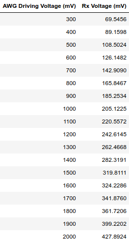
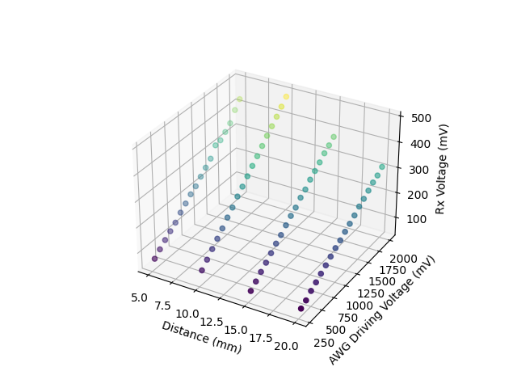

# Experiment 2: Arbitrary Waveform Gnerator Driven Transmitter

## Introduction

From Experiment 1, we concluded that the ultrasonic waves emitted by the ultrasonic sensor lost too much energy while being transmitted in the air to produce a large enough voltage across the receiver terminals to power an LED. For more granular control and the ability to increase the amplitude of the 40kHz electric pulses into the transmitter, we're going to use a Picoscope's arbitrary waveform generator. The Picoscope will also allow us to measure the signal on the receiver terminals accurately.

## Methods

Below is the schematic of the circuit we implement for this experiment.

And below are photos of the implemented circuit. The transmitter and receiver circuits are on the right and left side respectively.

Top View                   |  Side View
:-------------------------:|:-------------------------:
  |  

The transmitter circuit is driven by voltage from the AWG and the scope's probe is measuring the voltage across the terminals of the receiver. We'll drive the AWG with a range of voltages from 0V to 2V and measure the AC voltage induced at the receiver terminals

## Results

For each amplitude driven by the AWG, we recorded the measurement of maxmium and minimum amplitude of the Rx voltage from a window of the Picoscope software once the waveform stabilized. For example, the waveform observed at the Rx with the AWG driving 2V is shown below.

For each AWG voltage, we found the difference between the minimum and maximum Rx voltage and divided it by two to find the amplitude of the Rx voltage.

Below is a table summarizing our measurements and calculations. The calculations are in the Jupyter Notebook in the `scripts` file, and the raw data can be observed in the `measurements` folder both as psdata and CSVs.

Rx-Tx Distance				          | Data Table
:------------------------------:|:------------------------------:
5mm				                      | 
10mm				                  | 

And below is a scatter plot of the summarized measurements.

## Discussion

TODO
