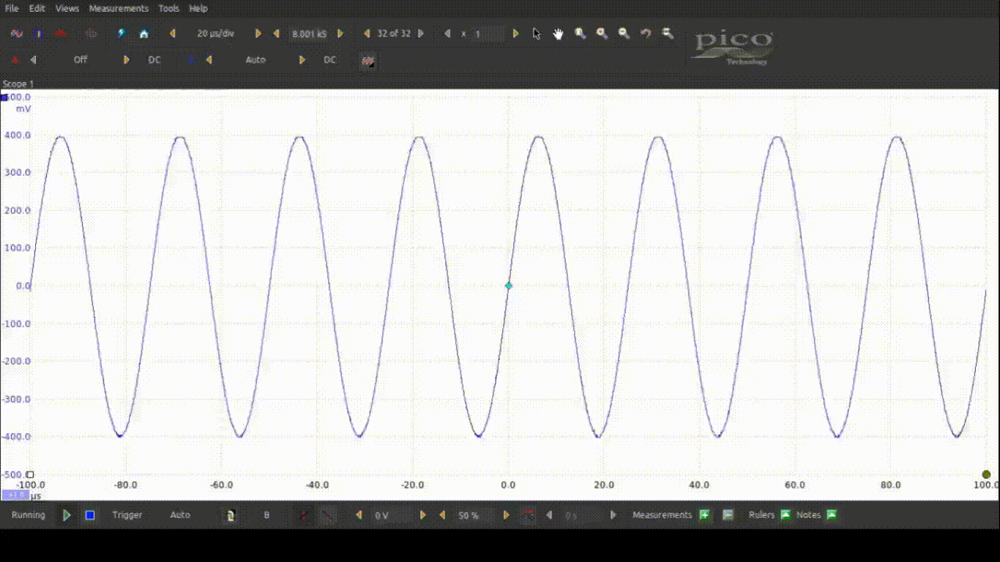
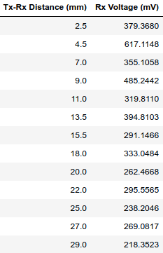
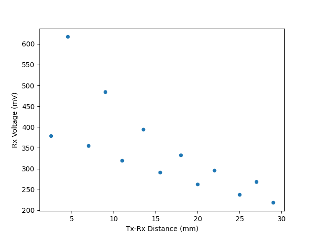

# Experiment 2_5: Transmitter Driven by Picoscope Arbitrary Waveform Generator - Exploring the transducers' oscillatory behavior to find optimal Tx-Rx separation distances for power transfer

## Introduction

This experiment is an addendum to Experiment 2 where we found that the Rx voltage for when the Tx-Rx distance is 10mm is greater than when it's 5mm. Strangely, more power was transfered at a greater distance. We investigate this behavior in this experiment. 

 | 
---|---

## Methods

This experiment's setup is identical to that of Experiment 2. We found the distances where the votlage across the receiver is at a local maxima and minima for a couple of trials. Starting at the closest distance between the receiver and transmitter where the Rx voltage is at a local maxima, we increase the distance between them until the Rx voltage local minima. Then, we pull it apart further until the Tx voltage is a local maxima again. The distances and Rx voltages are recorded at each one of these instances.

## Results

When pulling the transmitter and receiver apart, we find that the voltage across the receiver, and thus the power transferred, oscillates between local maximas and minimas. See the animation in the Introduction.

Below is the Tx-Rx distance and Rx voltage for each data point of a maxima or minima, along with a scatter plot visualizing the data.

## Discussion

TODO
